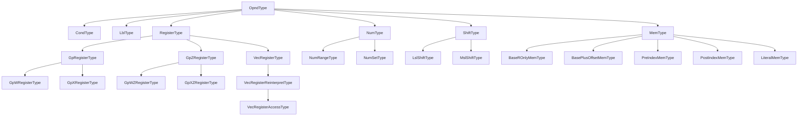
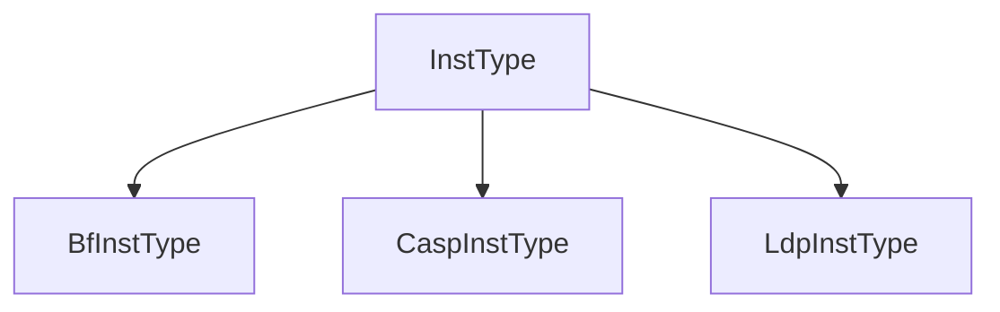
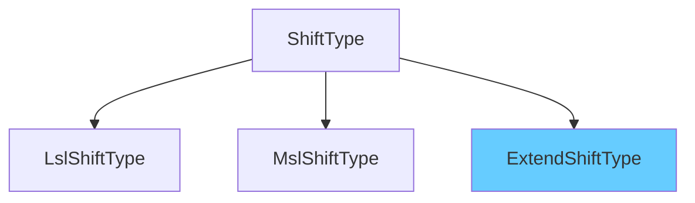

对超级优化项目进行debug。

## 1、mov指令立即数范围问题

问题出现在对立即数的解析，报错信息为：

```
[2025-01-15 08:21:13.420] [debug] w11
[2025-01-15 08:29:31.430] [debug] #0x80000000
[2025-01-15 08:29:35.137] [error] imm out of range: the 1-th operand of mov
Syntax Error: imm out of range
terminate called after throwing an instance of 'std::runtime_error'
  what():  Parser Syntax Error at line : 3
[1] + Done                       "/usr/bin/gdb" --interpreter=mi --tty=${DbgTerm} 0<"/tmp/Microsoft-MIEngine-In-2tlxh2ri.1gq" 1>"/tmp/Microsoft-MIEngine-Out-w1kwel15.21w"
```

定位原因在于，对立即数字符串的解析没有进行区分。例如，对于`mov w11, #0x80000000`，会把`0x80000000`解析为`2147483648`，而不是`-2147483648`，导致判定指令是否合法（立即数是否在允许范围内，也就是[-2147483648, 2147483647]）时报错。

相关函数片段如下：

```c++
......
int64_t value = parse_number(imm_str);
......
......
    if (lo <= value && value <= hi) {
		......
    } else {
      	spdlog::error("imm out of range: the {}-th operand of {}", op_id,
                    inst_id_str);
      	......
    }
......
```

需要对解析函数进行修改，使得返回多个可能的值，或者根据当前已经解析出的InstType补充判断逻辑，使用不同的解析数字字符串函数。

增加一个函数。

```c++
class ProgramReader {
public:
    int32_t parse_32bit_signed_number(std::string num_str);
};

int32_t ProgramReader::parse_32bit_signed_number(std::string num_str) {
    // 检查字符串是否以 '#' 开头
    if (num_str[0] == '#') {
        num_str = num_str.substr(1); // 去掉开头的 '#'
    }

    // 检查字符串是否是十六进制格式
    bool is_hex = (num_str.substr(0, 2) == "0x" || num_str.substr(0, 2) == "0X");

    // 使用输入字符串创建字符串流
    istringstream iss(num_str);
    int32_t num = 0;

    // 将字符串解析为十六进制或十进制数
    if (is_hex) {
        uint32_t temp_num = 0;
        iss >> hex >> temp_num; // 解析为十六进制数
        num = static_cast<int32_t>(temp_num); // 转换为有符号整数
    } else {
        num = stoi(num_str); // 解析为十进制数
    }

    return num;
}

```

同时增加判断逻辑如下。

```c++
// parser.cpp
// 根据寄存器的不同进行不同的解析。W --> 32bit-signed; X --> 64bit-signed
int64_t value;
const auto reg_at_inst = dynamic_cast<RegisterType *>(
      only_type->operand_types.at(0));
if (reg_at_inst != nullptr && reg_at_inst->isGpW()) {
  value = parse_32bit_signed_number(imm_str);
} else {
  value = parse_number(imm_str);
}

```

## 2、支持标量寄存器扩展

需要支持的扩展类型包括`uxtb` 、 `uxth` 、 `uxtw` 、 `uxtx` 、 `sxtb` 、 `sxth` 、 `sxtw` 和 `sxtx`。

对于这些扩展类型，可以参考[sub](https://developer.arm.com/documentation/ddi0602/2024-12/Base-Instructions/SUB--extended-register---Subtract-extended-and-scaled-register-?lang=en#amount__4)的情况。

一个可能的格式为`SUB <Xd|SP>, <Xn|SP>, <R><m>{, <extend> {#<amount>}}`

其中对amount的描述如下：

> amount是扩展后要应用的左移量，范围为 0 到 4，默认为 0，在“imm3”字段中编码。当 \<extend> 不存在时，它必须不存在；当 \<extend> 为 LSL 时，它是必需的；当 \<extend> 存在但不为 LSL 时，它是可选的。

### 2.1 语法分析

已经添加过了，将`EXTEND_KIND`和`IMM`分开进行处理：

```
EXTEND_KIND: 'uxtb' | 'uxth' | 'uxtw' | 'uxtx' | 'sxtb' | 'sxth' | 'sxtw' | 'sxtx';
```

但是为了与语义分析相配合，考虑将EXTEND_KIND与Shift结合起来进行处理。

也就是：

```
fragment EXTEND_KIND: 'uxtb' | 'uxth' | 'uxtw' | 'uxtx' | 'sxtb' | 'sxth' | 'sxtw' | 'sxtx';

EXTEND: EXTEND_KIND ( IMM )? ;

shift
    : ('lsl' | 'LSL') IMM
    | ('lsr' | 'LSR') IMM
    | ('asr' | 'ASR') IMM
    | ('ror' | 'ROR') IMM
    | EXTEND
    ;
```

这样的话，也可以把mem的定义给简化：

```c++
mem
  : '[' REGISTER ',' IMM ']'
  | '[' REGISTER ',' REGISTER ( ',' shift)?']' // 之前是  | '[' REGISTER ',' REGISTER ((',' EXTEND_KIND (IMM)?) | (',' shift))?']'
  | '[' REGISTER ']' ',' REGISTER
  | '[' REGISTER ']'
  | '[' REGISTER ',' IMM ']' '!'
  | '[' REGISTER ']' ',' IMM
  ;
```


### 2.2 OpndType添加

需要增加一个新的操作类型，在此对相关的类进行梳理。



下面是InstType的类图，如下所示。



而对于扩展，我们有几种可能的方案。

1. 新建一个`OpndType`的子类，也就是`ExtendType`，类比`ShiftType`进行处理。
2. 新建一个`ShiftType`的子类，可以命名为`ExtendShiftType`，然后进行处理。
3. 直接在原有的`ShiftType`类中进行处理。

考虑到在asmjit库中，各种扩展实际上都是ShiftOp（如下所示），我们选定**方案2**进行处理。

```c++
/* 
 * ./src/asmjit/core/archcommons.h 
*/
enum class ShiftOp : uint32_t {
  //! Shift left logical operation (default).
  //!
  //! Available to all ARM architectures.
  kLSL = 0x00u,

  //! Shift right logical operation.
  //!
  //! Available to all ARM architectures.
  kLSR = 0x01u,

  //! Shift right arithmetic operation.
  //!
  //! Available to all ARM architectures.
  kASR = 0x02u,

  //! Rotate right operation (AArch32 only).
  kROR = 0x03u,

  //! Rotate right with carry operation (encoded as `ShiftOp::kROR` with zero) (AArch32 only).
  kRRX = 0x04u,

  //! Shift left by filling low order bits with ones.
  kMSL = 0x05u,

  //! UXTN extend register operation (AArch64 only).
  kUXTB = 0x06u,
  //! UXTH extend register operation (AArch64 only).
  kUXTH = 0x07u,
  //! UXTW extend register operation (AArch64 only).
  kUXTW = 0x08u,
  //! UXTX extend register operation (AArch64 only).
  kUXTX = 0x09u,

  //! SXTB extend register operation (AArch64 only).
  kSXTB = 0x0Au,
  //! SXTH extend register operation (AArch64 only).
  kSXTH = 0x0Bu,
  //! SXTW extend register operation (AArch64 only).
  kSXTW = 0x0Cu,
  //! SXTX extend register operation (AArch64 only).
  kSXTX = 0x0Du

  // NOTE: 0xE and 0xF are used by memory operand to specify POST|PRE offset mode.
};
```

实际上结构如下所示，蓝色为新建的一个数据结构。



需要一些数据结构，用于辅助`ExtendShiftType`类工作。

```c++
enum class ExtendType {
    UXTB,
    UXTH,
    UXTW,
    UXTX,
    SXTB,
    SXTH,
    SXTW,
    SXTX
};
```

`ExtendShiftType`类的代码如下所示。

```c++
class ExtendShiftType : public ShiftType {
public:
   
    static ExtendShiftType *get(ExtendType extendType, 
                        int64_t lo = std::numeric_limits<int64_t>::min(),
                        int64_t hi = std::numeric_limits<int64_t>::max()) {
        static std::map<std::pair<NumType*, ExtendType>, ExtendShiftType *> num_type_map;
        auto type = NumRangeType::get(lo, hi);
        auto key = std::make_pair(type, extendType);
        if (num_type_map.find(key) == num_type_map.end()) {
            auto t = new ExtendShiftType();
            t->numType = type;
            t->extendType = extendType; // 初始化扩展类型
            num_type_map[key] = t;
        }
        return num_type_map[key];
    }

    virtual std::string to_string() const override {
        switch (extendType) {
            case ExtendType::UXTB: return "uxtb";
            case ExtendType::UXTH: return "uxth";
            case ExtendType::UXTW: return "uxtw";
            case ExtendType::UXTX: return "uxtx";
            case ExtendType::SXTB: return "sxtb";
            case ExtendType::SXTH: return "sxth";
            case ExtendType::SXTW: return "sxtw";
            case ExtendType::SXTX: return "sxtx";
            default: return "unknown";
        }
    }

    virtual bool isShift() const override { return true; }

    asmjit::a64::ShiftOp toShiftOp() const {
        switch (extendType) {
            case ExtendType::UXTB: return asmjit::a64::ShiftOp::kUXTB;
            case ExtendType::UXTH: return asmjit::a64::ShiftOp::kUXTH;
            case ExtendType::UXTW: return asmjit::a64::ShiftOp::kUXTW;
            case ExtendType::UXTX: return asmjit::a64::ShiftOp::kUXTX;
            case ExtendType::SXTB: return asmjit::a64::ShiftOp::kSXTB;
            case ExtendType::SXTH: return asmjit::a64::ShiftOp::kSXTH;
            case ExtendType::SXTW: return asmjit::a64::ShiftOp::kSXTW;
            case ExtendType::SXTX: return asmjit::a64::ShiftOp::kSXTX;
            default: return asmjit::a64::ShiftOp::kLSL; // Default case
        }
    }

    bool isUXTB() const { return extendType == ExtendType::UXTB; }
    bool isUXTH() const { return extendType == ExtendType::UXTH; }
    bool isUXTW() const { return extendType == ExtendType::UXTW; }
    bool isUXTX() const { return extendType == ExtendType::UXTX; }
    bool isSXTB() const { return extendType == ExtendType::SXTB; }
    bool isSXTH() const { return extendType == ExtendType::SXTH; }
    bool isSXTW() const { return extendType == ExtendType::SXTW; }
    bool isSXTX() const { return extendType == ExtendType::SXTX; }

private:
    ExtendShiftType() {}
    ExtendType extendType;
};
```

### 2.3 InstType的添加

添加了对应的Type之后，还需要增加几行新的InstType，已完成识别。

有很多种指令会遇到扩展的情况，例如，add、sub、ldr、str等。考虑到我们目前只遇到了add和cmp，暂时只添加这种情况。

```c++
// instruction.cpp
#define EXTEND_SHIFT(extend_kind) ExtendShiftType::get(extend_kind)
#define EXTEND_SHIFT(extend_kind, lo, hi) ExtendShiftType::get(extend_kind, lo, hi)

const unordered_multimap<InstId, InstType*> legal_inst_type_multimap = {
        
        //......
        
        {Inst::kIdAdd, InstType::get(REG_GPXZ, REG_GPXZ, REG_GPXZ, ExtendShiftType::get(ExtendType::SXTW, 0, 4))},
    	
        //......
    
    	{Inst::kIdCmp, InstType::get(REG_GPWZ, REG_GPWZ, ExtendShiftType::get(ExtendType::SXTW, 0, 31))},
    	
    	//......
        
};
```

### 2.4 Parser函数的处理

考虑到对于前端的处理，因此这里的处理是比较容易的，在原有的对`Shift`的处理逻辑中添加即可。需要考虑到的是，在`IMM`缺失时，设置立即数为0（默认值），也就是`inst->setOp(op_id, Imm(asmjit::arm::ShiftOp::kLSL, 0));`。

添加的代码如下所示。

```c++
// 第一遍遍历
if (ctx->shift() != nullptr) {
  // 这里我们只记录一个 shift_op_type，真正加入 operand 放到后面。
  if(ctx->shift()->EXTEND()!=nullptr){
    // 对于EXTEND
    string shift_op_str = ctx->shift()->EXTEND()->children[0]->getText();
    spdlog::debug("set {} shift at {}", shift_op_str, op_id);
    if (extend_op_map.find(shift_op_str) != extend_op_map.end()) {
      shift_op = (int)extend_op_map.at(shift_op_str);
    } else {
      spdlog::error("unknown shift: {}", shift_op_str);
      throw RecognitionException("unknown shift", parser,
                               parser->getInputStream(), ctx);
    }
  } else {
    // 处理正常的shift
    string shift_op_str = ctx->shift()->children[0]->getText();
    spdlog::debug("set {} shift at {}", shift_op_str, op_id);
    if (shift_op_map.find(shift_op_str) != shift_op_map.end()) {
      shift_op = (int)shift_op_map.at(shift_op_str);
    } else {
      spdlog::error("unknown shift: {}", shift_op_str);
      throw RecognitionException("unknown shift", parser,
                                parser->getInputStream(), ctx);
    }
  }
}
// 第二遍遍历
if (ctx->shift() != nullptr) {
  assert(only_type->operand_types.at(op_id)->isShift());
  assert(shift_op != -1);
  // 处理扩展的情况
  string num_str = "0";
  if(ctx->shift()->EXTEND() != nullptr){
    if(ctx->shift()->EXTEND()->children[1] == nullptr){
      // IMM 是可选的，如无，默认为0
      num_str = "0";
    }else{
      num_str = ctx->shift()->EXTEND()->children[1]->getText();
    }
    spdlog::debug(num_str);
    int64_t value = parse_number(num_str);

    auto extendShiftType =
        dynamic_cast<ExtendShiftType *>(only_type->operand_types.at(op_id));
    if (extendShiftType->getNumType()->isNumRange()) {
      int64_t lo =
          dynamic_cast<NumRangeType *>(extendShiftType->getNumType())->lo;
      int64_t hi =
          dynamic_cast<NumRangeType *>(extendShiftType->getNumType())->hi;
      if (lo <= value && value <= hi) {
        inst->setOp(op_id, Imm(Shift((ShiftOp)shift_op, value)));
      } else {
        spdlog::error("imm out of range: the {}-th operand of {}", op_id,
                      inst_id_str);
        throw RecognitionException("imm out of range", parser,
                                  parser->getInputStream(), ctx);
      }
    }
  }else{
    // 处理正常shift的情况
    string num_str = ctx->shift()->children[1]->getText();
    spdlog::debug(num_str);
    int64_t value = parse_number(num_str);
    if (only_type->operand_types.at(op_id)->isLslShift())
      assert((ShiftOp)shift_op == asmjit::arm::ShiftOp::kLSL);

    auto shiftType =
        dynamic_cast<ShiftType *>(only_type->operand_types.at(op_id));
    if (shiftType->getNumType()->isNumRange()) {
      int64_t lo =
          dynamic_cast<NumRangeType *>(shiftType->getNumType())->lo;
      int64_t hi =
          dynamic_cast<NumRangeType *>(shiftType->getNumType())->hi;
      if (lo <= value && value <= hi) {
        inst->setOp(op_id, Imm(Shift((ShiftOp)shift_op, value)));
      } else {
        spdlog::error("imm out of range: the {}-th operand of {}", op_id,
                      inst_id_str);
        throw RecognitionException("imm out of range", parser,
                                  parser->getInputStream(), ctx);
      }
    } else {
      assert(shiftType->getNumType()->isNumSet());
      unordered_set num_set =
          dynamic_cast<NumSetType *>(shiftType->getNumType())->numSet;
      if (num_set.contains((int)value)) {
        inst->setOp(op_id, Imm(Shift((ShiftOp)shift_op, value)));
      } else {
        spdlog::error("imm out of range: the {}-th operand of {}", op_id,
                      inst_id_str);
        throw RecognitionException("imm out of range", parser,
                                  parser->getInputStream(), ctx);
      }
    }
  }
  ++op_id;
}
```

由于之前的修改，需要对mem也进行处理：

```c++
//......
  } else if (ctx->mem()->shift()->EXTEND() == nullptr) {// 修改了这一行
    // ldr w9, [x0, x1, lsl #2]
    assert(ctx->mem()->REGISTER().size() > 1);
    if (ctx->mem()->shift() != nullptr)
      mem_op =
          Mem(baseReg, indexReg, Shift(ShiftOp::kLSL, shift_value));
    else {
      string extend_op_str = ctx->mem()->shift()->EXTEND()->children[0]->getText();// 修改了这一行
      ShiftOp extend_op;
      if (extend_op_map.find(extend_op_str) != extend_op_map.end()) {
        extend_op = extend_op_map.at(extend_op_str);
//......
```

